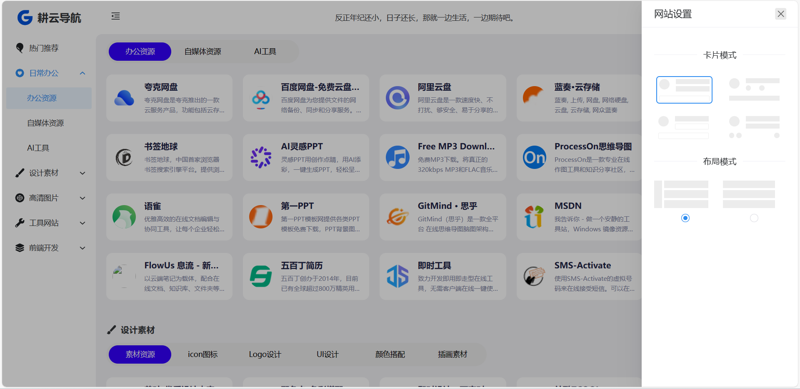

<p align="center">
  <a href="http://nav.untview.top/">
    
  </a>
  <br />
  <b>耕云导航</b>
  <p align="center">一款基于Vue3、Vite、Naive-UI和ThinkPHP6.0的前后台分离的简洁</p>
  <p align="center"> 自适应开源导航网站，包含多种页面布局和卡片模式，优化内容提升用户体验。</p>
  <p align="center">
    <a href="README.md">
      
    </a>
  </p>
</p>

<br />
<br />

## 使用须知

- 本人开发能力不是很牛，哪些很厉害的大神不要用了再喷！！！
- 耕云导航目前为v1.0.0版本，后会继续更新增加新功能；也欢迎大家提出宝贵建议。


## 仓库

#### Github
- 前台源码
[gengyun-nav](https://github.com/xsdeyun/gengyun-nav)
- 后台源码
[gengyun-nav-system](https://github.com/xsdeyun/gengyun-nav-system)
- 服务端源码
[gengyun-nav-server](https://github.com/xsdeyun/gengyun-nav-server)


#### Gitee
- 前台源码
[gengyun-nav](https://gitee.com/song-xiansen/gengyun-nav)
- 后台源码
[gengyun-nav-system](https://gitee.com/song-xiansen/gengyun-nav-system)
- 服务端源码
[gengyun-nav-server](https://gitee.com/song-xiansen/gengyun-nav-server)


## 预览
**主题**

- [耕云导航 在线预览](http://nav.untview.top/)

- [耕云导航后台 在线预览](http://nav.untview.top/houTai)<br/>
账号：test，密码：123456 





## 特性
`耕云导航` 一款简约的综合性导航网站，摆脱书签很多无法找寻的困扰，追求自由、完美的你。
后台系统由 `耕云计划` 强力驱动，后台带有角色人员管理等，可自行开发对接其他项目；后台系统不止是耕云导航的后台，更是项目综合平台。

- 🏷️ 内置 `180+` 实用网站。
- 🏷️ 三叉树分类、结构清晰、分类清晰。
- 🏷️ 支持一个网站关联多个菜单
- 🏷️ 颜值与简约并存，多种模式。
- 🏷️ 完全开源，轻松定制化。
- 🏷️ 支持多种浏览模式，创新。
- 🏷️ 支持移动端浏览。
- 🏷️ 支持搜索查询。
- 🏷️ 支持自定义引擎搜索。
- 🏷️ 支持暗黑模式。
- 🏷️ 支持后台管理。


## 开发构建 部署
NODE: v16 <br />
注意：<br />
将`vite.config` 中的 `http://127.0.0.1/` 替换成你网站域名<br />
将`.env.production` 中的 `/index.php?s=` 替换成 域名/index.php?s=<br />

``` bash
# 下载
git clone  https://gitee.com/song-xiansen/gengyun-nav.git

cd gengyun-nav

# 安装依赖 NODE: v16
pnpm

# 启动
pnpm dev

# 打包
pnpm build
```


## 更新日志
[CHANGELOG](https://gitee.com/song-xiansen/gengyun-nav/releases)


## 建议
如果有任何功能上的建议可通过 [issue](https://gitee.com/song-xiansen/gengyun-nav/issues) 发起, Thank you.

## 微信公众号
关注 `耕云计划` 微信公众号，第一时间了解最新信息。


## 赞赏
如果你觉得这个项目帮助到了你，赏一杯奶茶给作者吧 🫰🫰🫰。<br/>
开源不易, 有了您的赞助, 我们会做的更好~


## 协议
[Apache2](./LICENSE)